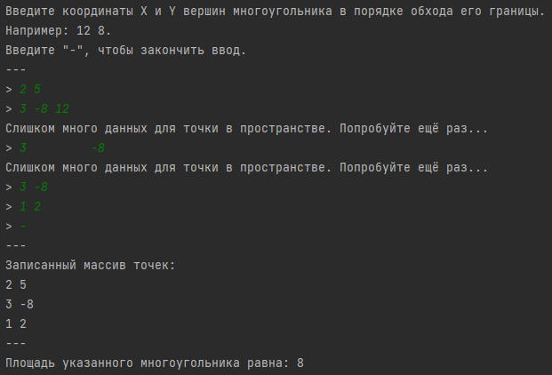

# Объектно-ориентированное программирование, ЛР 1
### Вариант 13
Выпуклый многоугольник задан на плоскости перечислением координат вершин в порядке обхода его границы. Определить площадь многоугольника.

## Скриншоты работы программы

